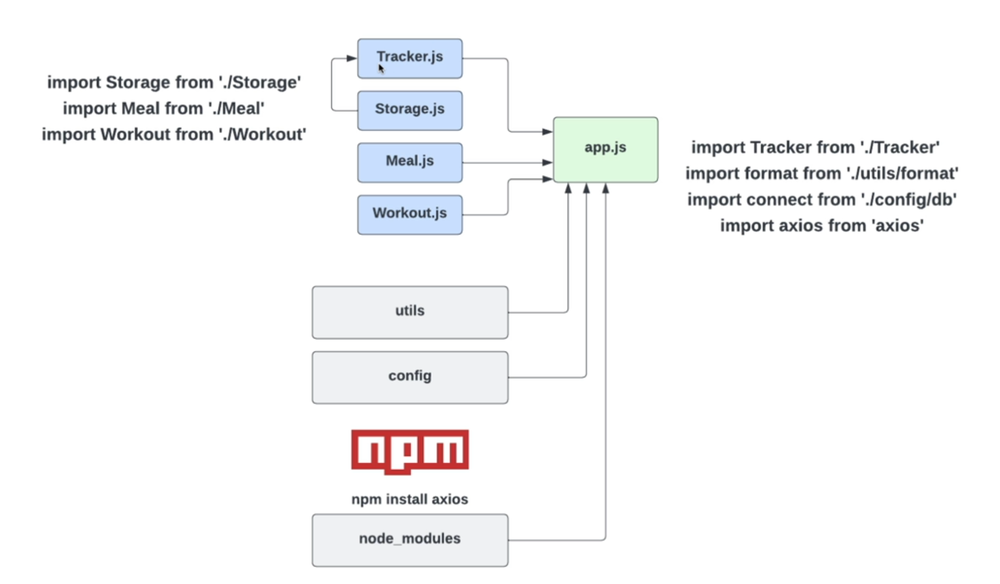

# Introduction to Modules and Tooling

We have created  a javaScript file then included it in our HTML to be loaded by the browser. And its fine for smaller applications or for websites where you have couple of components.
But when you start to get into more advanced developement with larger applications, that doesn't really fly. Even with our TrackCalorie project having 5 different classes in one file is not really ideal, is not really organized.

So that's where the modules come in and we can seperate our code into different files and we can import them into one another.
Al we get to use the javascript package manager called NPM or ndoe package manager.

## Popular Modules Types
There are two different types of modules which is popular-:
1) ES modules
2) commonjs modules

As far as browser compatibility goes, most modern browsers do support is ES modules. You do have to add a type attribute and set it to module.
But older browser don't support this and where the module bundlers come in.

### Module Bundlers
Module Bundlers -> are extremly powerful. We can use our own modules, we can also use NPM packages.

So there is a lot of bundlers out there but the one we will use **Webpack**.


## What are Modules?
Modules are just JavaScript files that we can import into other javascript files.
We can export and import things like **variables, functions and classes**.
We can also import 3rd-party packages from **NPM** (Node Package Manager). However if you want use NPM than you'll have to use module bundler for frontend.


## Why use Modules and Tooling?
- Makes your code much more organized and easy to read/write by breaking it up into seperate files.
- Reusablity 
- NPM pakcages
- Opitmization
- Customized environment

> Example:- When we have 100 classes so it would be more organized to put each classes into its own module and than we can import that modules, all those modles into App.js

## Types of Modules
- **Common JS Modules** -: Commonly used by Node.js
- **ES Modules (ESM, ES6 Modules)** -: Commonly used in the front-end.

> *Modules are not supported in older browsers. There is support for ES modules in newer browsers, but it is still recommended to use a module bundler.*

But when use a front end framework like react or angular or you build a large front end vanilla javascript project you're going to use ES Modules.




## What is Node.js?
Node is a javascript runtime environment. It allows javascript to run on the server much like any other language such as python, ruby , java etc.

Node uses the V8 JS engine, which is the same engine that Chrome uses.

THe inner workings are simillar to the browser, since it uses the v8 engine. Obviously, there is no `Window` or `Document` in Node.
It uses an event loop, callbacks, promises, async, await all stuff. So it's essentially the browser environment - window object and node does have a global object. So it's not called window, it's called global.

```bash
mkdir node-playground
cd node-playground
touch app.js
code .
```

> **How to run Node.js?** 
In app.js
```js
    console.log('Hello from Node.js);
```
Run `node app.js`  or  `node app`

We will see output in terminal not in the browser environment. So console doesn't pertain to the browser console, it pertain to the actual operating system where we're running our file from.

💡 **Example:** Using Node.js with Fetch to Get My GitHub Profile Data
```js
async function getUser(){
    const response = await fetch('https://api.github.com/users/nilansukumarsingh');
    const data = await response.json();
    console.log(data);
}

getUser();
```
